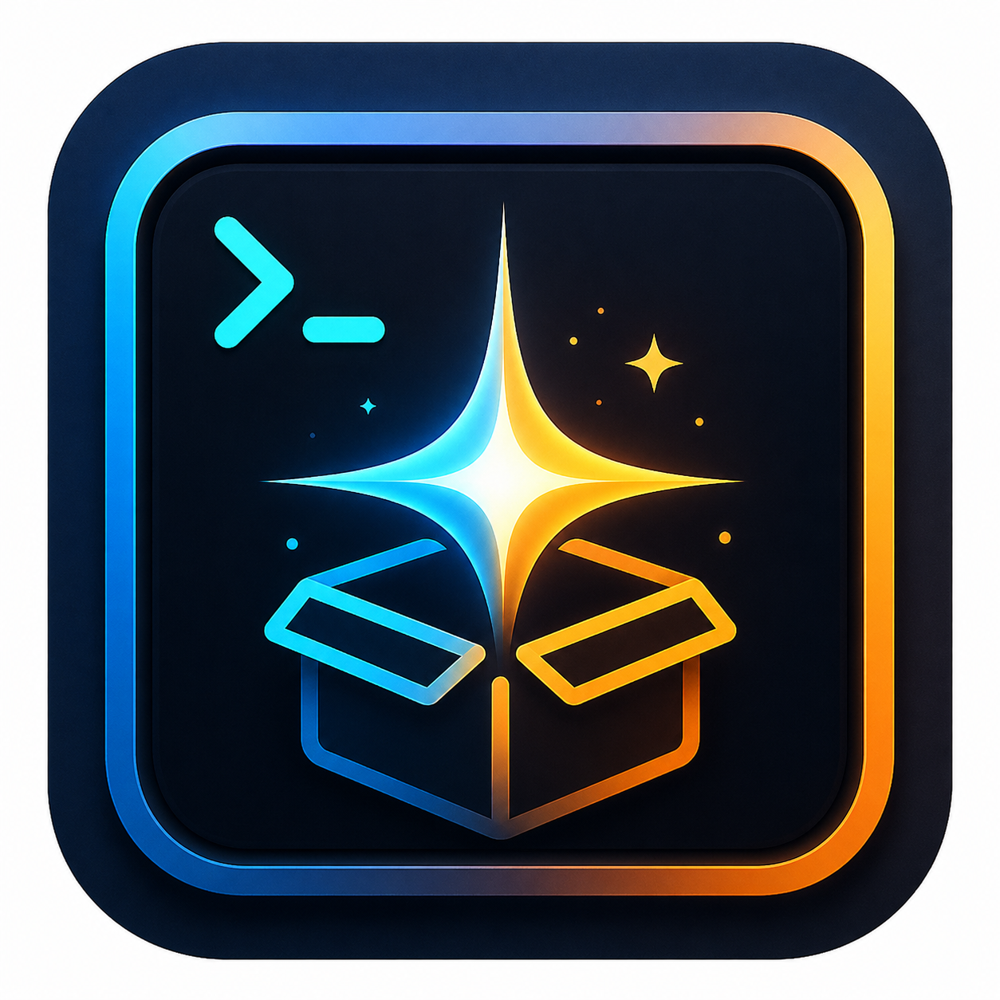

<p align="center">
  
</p>

<h1 align="center">Spark Store TUI</h1>

<p align="center">星火终端助手 · 原生 Linux 软件管理终端界面</p>

<p align="center">
  <a href="https://gitee.com/spark-store-project">
    
    <br>
    <strong>本项目附属于星火商店</strong>
  </a>
</p>

<p align="center">
  <a href="https://gitee.com/spark-store-project/spark-store-tui/releases/tag/v0.8.3"></a>
  <a href="https://gitee.com/spark-store-project/spark-store-tui"></a>
  <a href="COPYING"></a>
  
</p>

> `sparkstore` 只读取 Spark Store 的公开 metadata，通过官方 Metalink 选择下载镜像，并在明确确认后调用对应发行版的官方安装后端安装或卸载软件。

当前稳定版：**0.8.3**；Debian 包修订版：**0.8.3-2**。

## 功能

- 自动识别 Debian/Ubuntu、Arch、Fedora/RHEL 与 openSUSE，以及 `x86_64` / `aarch64` / `loongarch64` 架构。
- 分类浏览、搜索、图标终端预览（可选 `chafa`）和长简介展开。
- Metalink 镜像回退、断点续传、下载任务持久化与无数据超时检测。
- 应用重启后自动识别完成包和中断任务；中断任务按 `D` 即可继续。
- `.deb`、RPM 和 Arch 本地包的确认安装；原生包管理器卸载；可选删除本地安装包。

应用来源只保留 **Spark Store**，不再显示第三方 Release 软件源或 APM Store。

## 依赖与下载流程

目录浏览和下载引擎由 TUI 原生实现，不通过 `aptss` 下载应用；Debian 包的安装与卸载依赖 **`aptss | spark-store`**。程序优先把下载完成的 `.deb` 交给官方 `ssinstall`，旧环境找不到 `ssinstall` 时回退到 `aptss`。`ca-certificates` 也是必需依赖；`sudo` 与用于图片预览的 `chafa` 是推荐依赖。

Debian/Ubuntu/UOS/麒麟上的正常流程如下：

1. 根据系统架构和分类读取 Spark Store 公开元数据。
2. 按 `D` 后解析应用的官方 Metalink，先检查文件名架构，拒绝把其他架构的软件包装到本机。
3. 按 Metalink 优先级依次尝试镜像，下载到 `~/Downloads/<文件名>.part`；已有分片会使用 HTTP Range 续传。
4. 任务状态保存在 `~/.config/sparkstore/tasks.json`。进程意外退出后，再次启动会识别完整包或可续传分片。
5. 有 SHA-256 时先校验，再将 `.part` 原子重命名为最终安装包；元数据没有 SHA-256 时会明确按未校验处理，不使用弱校验冒充 SHA-256。
6. 下载完成后按 `I` 或 `Enter`，优先通过官方 `ssinstall <本地.deb>` 处理依赖、安装与桌面集成；旧环境回退到 `aptss install <本地.deb> -y`。按 `Esc` 只保留安装包。

如果 `~/Downloads` 已有同名完整包，再按 `D` 会提示直接安装、重新下载、删除或取消，不会静默重复下载。一键安装脚本会从星火官方软件包服务器下载、校验并安装 `aptss`；如果直接安装 Release 中的 Deb，则需要本机已经安装 `aptss` 或完整的 Spark Store。

Arch、Fedora/RHEL 与 openSUSE 不下载 Spark Store 的 `.deb`，选中应用后会通过 Amber APM 安装；缺少 `apm` 时会给出错误。一键安装脚本会尝试按发行版补齐 Amber APM，但 TUI 启动本身不依赖它。

## 命令

标准命令为：

```bash
sparkstore
```

安装包另外提供 `SparkStore`、`SPARKSTORE` 和旧命令 `spark-store-tui`。Linux 命令名区分大小写，未列出的大小写组合不能由 shell 自动识别。

## WSL / 本地开发

需要 Go 1.25 或更新版本。在 WSL 的 `/mnt/c` 目录中可直接执行：

```bash
go test ./...
go vet ./...
mkdir -p build
go build -buildvcs=false -o build/sparkstore ./cmd/spark-store-tui
./build/sparkstore
```

`-buildvcs=false` 避免 Git 对 Windows 挂载目录的所有权检查。图片预览是可选的：运行 `sparkstore --bootstrap-images` 可按发行版安装 `chafa`。

## 快捷键

进入应用页后：`/` 搜索、`[` / `]` 切换分类、`D` 下载/续传、`I` 安装、`U` 卸载、`E` 展开简介、`R` 刷新、`q` 退出。

下载中断或进程被关闭后，下一次启动会将任务标记为“可继续”，而不会卡住 UI；选中对应应用后按 `D` 继续下载。

## 发布物与后缀

| 平台 | 发布物 | 后缀 / 架构 |
|---|---|---|
| Debian / Ubuntu / UOS / 麒麟 | Debian 包 | `spark-store-tui_0.8.3-2_amd64.deb`、`..._arm64.deb`、`..._loong64.deb` |
| Fedora / RHEL / openSUSE / 银河麒麟 | RPM | `spark-store-tui-0.8.3-3.<arch>.rpm`（含 `loongarch64`） |
| Arch Linux | AUR 源包 | `spark-store-tui`（构建本机架构二进制） |
| 通用构建 | 源码包 | `spark-store-tui-source-0.8.3-r3.tar.gz` |

`v0.8.3` 同时提供 `amd64` / `x86_64`、`arm64` / `aarch64` 与 `loong64` / `loongarch64` 的 Deb、RPM。仓库中的 [`apt/`](apt/README.md) 与 [`rpm/`](rpm/README.md) 只是冻结在 `0.7.2` 的历史归档，为避免已有软件源立即失效而保留，不代表当前版本，也不再用于新安装或更新；Gitee 当前没有 APT/RPM Pages 仓库。请使用本页的一键安装命令或 `v0.8.3` Release，并只下载与本机架构匹配的包。

### 麒麟 / 统信 / 信创架构

发行版名称不是决定因素，先执行 `uname -m`：

| `uname -m` | 常见设备 | 当前使用方式 |
|---|---|---|
| `x86_64` | Intel / AMD 麒麟、统信 | 使用 `amd64` Deb 或 `x86_64` RPM |
| `aarch64` | 鲲鹏、飞腾、兆芯 ARM 等 | 使用 `arm64` Deb 或 `aarch64` RPM |
| `loongarch64` | 龙芯新平台 | 使用 `loong64` Deb 或 `loongarch64` RPM |
| 其他值 | 需单独确认 | 不要安装 amd64 包；优先源码构建并反馈 `uname -m` 输出 |

星火 TUI 是纯 Go 程序，预编译包只影响安装便利性，不改变应用功能。麒麟 V10/统信既可能是 `x86_64`，也可能是 `aarch64` 或 `loongarch64`，不能仅凭系统名称下载包。

### Debian / Ubuntu

推荐使用后文的一键安装命令，它会自动补齐官方 `aptss`。如果需要直接安装发布物，可同时安装经过固定 SHA-256 校验的官方 `aptss`：

```bash
curl -LO https://d.spark-app.store/store/depends/aptss_4.8.1-1_all.deb
echo 'cd95de3488f7e39ce0300b1e3ba38b0c9416871e68fb91098011ace26f057751  aptss_4.8.1-1_all.deb' | sha256sum -c -
curl -LO https://gitee.com/spark-store-project/spark-store-tui/releases/download/v0.8.3/spark-store-tui_0.8.3-2_amd64.deb
sudo apt install ./aptss_4.8.1-1_all.deb ./spark-store-tui_0.8.3-2_amd64.deb
```

aarch64 设备将文件名中的 `amd64` 替换为 `arm64`；龙芯设备替换为 `loong64`。

### 一键安装（国内镜像）

安装器会检测发行版和 CPU 架构；Debian 系会先补齐并校验官方 `aptss`，Deb/RPM 再下载并校验对应发行包。缺少本机架构附件时，它会明确询问是否从同一 tag 的源码构建，不会静默安装其他架构。Arch 仍按 AUR 规则调用 `yay` 安装 TUI；Arch/Fedora 上的星火应用通过 Amber APM 安装。

```bash
bash <(curl -fsSL https://gitee.com/spark-store-project/spark-store-tui/raw/master/scripts/install-sparkstore.sh) --mirror gitee
```

命令已固定使用国内镜像，不再显示镜像选择提示。直接运行脚本而不附带参数时，仍可交互选择网络环境。

### 国内网络 / Gitee 安装

Debian / Ubuntu 已安装 `aptss` 或 Spark Store 时，可直接下载 Gitee Release：

```bash
curl -LO https://gitee.com/spark-store-project/spark-store-tui/releases/download/v0.8.3/spark-store-tui_0.8.3-2_amd64.deb
sudo apt install ./spark-store-tui_0.8.3-2_amd64.deb
```

Gitee 也可用于源码构建：

```bash
git clone --depth 1 --branch v0.8.3 https://gitee.com/spark-store-project/spark-store-tui.git
cd spark-store-tui
go build -buildvcs=false -o sparkstore ./cmd/spark-store-tui
sudo install -Dm755 sparkstore /usr/local/bin/sparkstore
sparkstore
```

RPM 直链：

```text
https://gitee.com/spark-store-project/spark-store-tui/releases/download/v0.8.3/spark-store-tui-0.8.3-3.x86_64.rpm
```

### RPM 系统

下载对应发行版与架构的 `.rpm` 后执行：

```bash
sudo dnf install ./spark-store-tui-0.8.3-3.x86_64.rpm
```

openSUSE 可使用：

```bash
sudo zypper install ./spark-store-tui-0.8.3-3.x86_64.rpm
```

### Arch Linux / AUR

已发布的 AUR Git 仓库与当前 Release 保持相同版本。AUR RPC/yay 索引在刚推送后可能短暂缓存旧版本；若 `yay -Si spark-store-tui` 仍显示旧版本，请等待索引同步，或直接从 AUR Git 仓库构建：

```bash
sudo pacman -S --needed base-devel go git
git clone https://aur.archlinux.org/spark-store-tui.git
cd spark-store-tui
makepkg -si
```

索引同步后可简化为 `yay -S spark-store-tui`。AUR 会在本机架构构建，因此适合 `aarch64` 与 `loongarch64` 等没有预编译附件的平台。

## 构建发布物

在对应 Linux 构建环境中：

```bash
make check
make build       # 本机架构 .deb
make source      # 通用 source tarball
```

RPM 与 AUR 模板位于 [packaging](packaging/README.md)。

## 许可证

GPL-3.0-only，详见 [COPYING](COPYING)。
